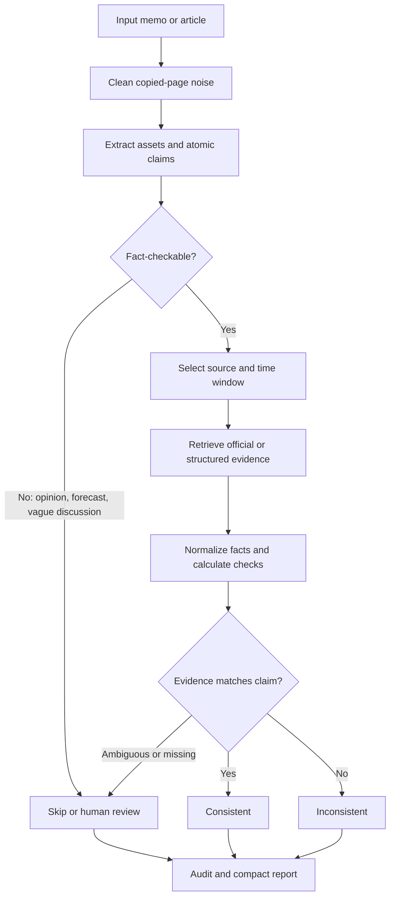

# Credence Analytics

<p><strong>An asset-class aware financial credibility agent for official-evidence verification.</strong></p>

[](LICENSE)
[](https://docs.astral.sh/uv/)
[](pyproject.toml)
[](pyproject.toml)

Credence Analytics is a local research prototype for verifying financial claims
against auditable evidence. The project has moved beyond a US-equity-only
credibility toolkit toward a memo-level agent that:

- accepts a free-form investment note or financial statement in a chat-style UI;
- extracts financial entities across asset classes, not just public-company
  tickers;
- decomposes the input into fact-checkable atomic claims;
- selects sources with progressive disclosure, loading detailed source
  descriptions only after compact candidate selection;
- retrieves official or structured evidence where runtime adapters exist;
- builds canonical facts, numeric derivations, confidence components, human
  review flags, and replayable audit traces;
- renders a readable verification report plus collapsible trace and raw
  Markdown.

The current strongest verification path is still public-company financial
statement checking through SEC EDGAR / data.sec.gov. Non-equity assets such as
macro indicators, commodities, FX, credit, rates, indexes, futures, ETFs, and
crypto are now detected and grouped in the report; full claim-level verification
for all of those classes is the next expansion layer.

## Workflow

GitHub renders the diagram below with Mermaid.



The key design rule is that a claim is only verified against evidence that
matches the asset class, metric, and time window. If the system cannot find a
compatible source, it should show insufficient evidence or human review instead
of forcing a mismatched data source.

## Quick Start

The package currently has no required third-party runtime dependencies.

```bash
PYTHONPATH=src python3 -m pytest -q
```

Run the local web UI:

```bash
PYTHONPATH=src python3 -m financial_credibility.webapp --port 8783
```

Open:

```text
http://127.0.0.1:8783
```

The UI has a single input box. Paste an investment memo, analyst note, or
financial statement. The app will extract entities automatically; you do not
need to type tickers manually.

Run the legacy CLI for one public-company ticker:

```bash
PYTHONPATH=src python3 -m financial_credibility \
  "NVIDIA reported very strong revenue growth in its latest quarter." \
  --ticker NVDA \
  --pretty
```

Editable install:

```bash
python3 -m pip install -e .
```

## What The UI Shows

The report UI is designed around reviewability rather than chatty answers:

- `Question`: the submitted input, collapsible so long memos do not dominate the
  screen.
- `Detected Asset Classes`: collapsible groups such as single-name equities,
  macro indicators, commodities, FX, credit, indexes, futures, ETFs, rates, and
  crypto. Only asset classes found in the input are shown.
- `Claim Checks`: one card per fact-checkable atomic claim.
- `Data Source Checked`: the source used for that claim.
- `What The Source Says`: extracted values or source excerpts.
- `Does It Match The Claim?`: plain-language support, inconsistency, partial
  support, or insufficient-evidence explanation.
- `Human Review`: shown on claims that trigger hard escalation rules.
- `Selected Sources`: source-selection decisions and rationale.
- `Trace`: collapsible audit trail of the agent workflow.
- `Rendered Report`: Markdown report rendered into HTML, with raw Markdown
  available in a collapsible block.

## Asset Classes

Entity extraction is now asset-class aware. It can identify and group:

- `single_name_equity`: AAPL, MSFT, NVDA, JPM, TSLA, etc.
- `equity_index`: S&P 500 / SPX, Nasdaq 100 / NDX, Russell 2000 / RUT.
- `equity_index_future`: ES, NQ, RTY futures.
- `fund_etf`: SPY, QQQ, IWM, HYG, LQD, TLT, GLD, USO.
- `commodity` and `commodity_future`: WTI, Brent, gold, copper, natural gas,
  CL, GC, NG.
- `fx`: EUR/USD, USD/JPY, GBP/USD, DXY.
- `rates`: Fed funds, SOFR, 2-year and 10-year Treasury yields.
- `credit`: high-yield spreads, investment-grade spreads, CDX, iTraxx, CDS.
- `macro_indicator`: CPI, core CPI, PCE, PMI, GDP, unemployment, NFP.
- `crypto`: BTC, ETH.
- `volatility_index`: VIX.

Example:

```text
NVDA revenue grew while CPI surprised higher, WTI rallied, EUR/USD weakened,
S&P 500 fell, ES futures sold off, and HY spreads widened.
```

This is grouped as:

- Single-name equities: NVDA
- Macro indicators: CPI
- Commodities: WTI
- FX: EUR/USD
- Equity indexes: SPX
- Equity index futures: ES
- Credit: HY_CREDIT

Only public-company tickers currently trigger the full memo-level
`EvidencePack` verification loop. Non-equity classes are surfaced as detected
scope so the system does not incorrectly treat `CPI`, `WTI`, or `SPX` as a
company ticker.

## Configuration

Copy `.env.example` to `.env`. `.env` is ignored by git.

```text
OPENAI_API_KEY=
OPENAI_MODEL=
ANTHROPIC_API_KEY=
ANTHROPIC_MODEL=
CREDIBILITY_LLM_PROVIDER=auto

SERPER_API_KEY=
JINA_API_KEY=

FINNHUB_API_KEY=
ALPHA_VANTAGE_API_KEY=
FMP_API_KEY=
FRED_API_KEY=
MARKETSTACK_API_KEY=
TIINGO_API_KEY=

SEC_USER_AGENT=

CREDIBILITY_STRUCTURED_SOURCES=true
CREDIBILITY_LIVE_EXTRACTION=false
CREDIBILITY_YAHOO_FALLBACK=false
CREDIBILITY_REQUEST_TIMEOUT=25

CREDIBILITY_TICKER_UNIVERSE_FILTER=true
CREDIBILITY_TICKER_UNIVERSE_FETCH=true
CREDIBILITY_TICKER_UNIVERSE_CACHE=.cache/financial_credibility/company_tickers_exchange.json

CREDIBILITY_ASSET_UNIVERSE_FILTER=true
CREDIBILITY_ASSET_UNIVERSE_FILE=
```

Important notes:

- `OPENAI_API_KEY` plus `OPENAI_MODEL` enables LLM entity extraction, source
  selection, and narrow semantic judging.
- If no LLM key/model is configured, the system falls back to deterministic
  heuristics where available.
- `SEC_USER_AGENT` is not a key, but SEC requests should include a descriptive
  user agent.
- `CREDIBILITY_TICKER_UNIVERSE_FILTER=true` helps prevent false ticker matches
  such as treating "AI" as a company unless the context is explicit.
- `CREDIBILITY_ASSET_UNIVERSE_FILTER=true` hard-filters non-equity extraction
  against built-in asset-class universes for indexes, futures, commodities, FX,
  rates, credit, macro indicators, ETFs, and crypto.
- `CREDIBILITY_ASSET_UNIVERSE_FILE` can point to a local JSON file for project
  additions such as custom indexes or internal baskets.

Local asset-universe file shape:

```json
{
  "assets": [
    {
      "asset_class": "equity_index",
      "symbol": "MYIDX",
      "name": "My Custom Index",
      "entity_type": "index",
      "aliases": ["custom index"]
    }
  ]
}
```

## Runtime Data Sources

These sources have runtime adapters today:

| Source id | What it covers | Key required? | Runtime status |
|---|---|---:|---|
| `sec_company_facts` | SEC XBRL company facts for reported financial metrics | No, but set `SEC_USER_AGENT` | Implemented |
| `sec_recent_filings` | SEC 10-K, 10-Q, 8-K filing metadata and links | No, but set `SEC_USER_AGENT` | Implemented |
| `treasury_fiscal_data` | U.S. Treasury fiscal/debt data | No | Implemented |
| `gleif_entity` | GLEIF LEI legal-entity lookup | No | Implemented |
| `fred` | FRED macro time series | Yes, `FRED_API_KEY` | Implemented |
| `bls_api` | BLS CPI, PPI, employment, wages, JOLTS | Optional but recommended, `BLS_API_KEY` | Implemented |
| `bea_api` | BEA GDP/NIPA/PCE/industry/regional data | Yes, `BEA_API_KEY` | Implemented |
| `eia_api` | EIA official energy prices and fundamentals | Yes, `EIA_API_KEY` | Implemented |
| `cftc_cot` | CFTC COT futures/options positioning | No, optional `CFTC_APP_TOKEN` | Implemented |
| `ecb_data_portal` | ECB SDMX statistics | No | Implemented |
| `bis_data_portal` | BIS banking, debt, liquidity, financial stability data | No | Implemented |
| `world_bank_indicators` | World Bank country-level indicators via API v2 | No | Implemented |
| `bank_of_england` | Bank of England IADB statistics | No | Implemented |
| `finra_query_api` | FINRA fixed-income/regulatory Query API datasets | Yes, `FINRA_CLIENT_ID` and `FINRA_CLIENT_SECRET` | Implemented |
| `openfigi` | FIGI / ISIN / CUSIP / ticker mapping | Optional `OPENFIGI_API_KEY` | Implemented |
| `historical_prices` | Historical price evidence via Alpha Vantage, FMP, Finnhub, or Stooq | Stooq no; others yes | Implemented |
| `company_fundamentals_vendor` | Alpha Vantage, Finnhub, FMP fundamentals | Yes, corresponding vendor key | Implemented |
| `market_prices_vendor` | Marketstack, Tiingo, Stooq latest/EOD prices | Stooq no; others yes | Implemented |
| `serper_web` | Supplemental web search | Yes, `SERPER_API_KEY` | Implemented |
| `yahoo_chart_unofficial` | Unofficial Yahoo chart fallback | No | Disabled by default |

Cost/access summary:

- Usually free/no key: SEC, Treasury Fiscal Data, GLEIF, CFTC, ECB, BIS,
  World Bank, Bank of England, Stooq.
- Free key or modest friction: FRED, BLS, BEA, EIA.
- OAuth/client credentials: FINRA.
- Key optional but useful for limits: OpenFIGI, CFTC app token.
- Vendor keys: Alpha Vantage, Finnhub, FMP, Marketstack, Tiingo.
- Web search: Serper key.
- Live page extraction: optional Jina Reader key.

## Source Catalog And Progressive Disclosure

Source metadata lives in:

```text
src/financial_credibility/source_selection.py
```

Long-form source descriptions live in:

```text
src/financial_credibility/source_descriptions/
```

The selector uses progressive disclosure:

1. Stage 1: show the LLM compact candidate cards with source id, authority tier,
   license tag, required inputs, and a brief description.
2. Stage 2: load detailed Markdown only for sources selected in stage 1.
3. Policy validation: discard unknown sources and prefer official primary
   sources for factual verification.

Planned source-library entries already have descriptions but are not yet
runtime-callable by default:

| Source id | Purpose | Runtime status |
|---|---|---|
| `xbrl_us_api` | XBRL US Public Filings API | Planned |
| `arelle` | Local XBRL/iXBRL parser and validator | Planned parser |
| `federal_reserve_ddp` | Federal Reserve DDP / Z.1 data | Planned |
| `ofr_stfm` | OFR short-term funding monitor | Planned |
| `imf_data_api` | IMF WEO, BOP, reserves, fiscal, CPI data | Planned |
| `esma_registers` | ESMA regulatory registers | Planned |
| `nasdaq_data_link` | Nasdaq Data Link / Quandl datasets | Planned |

Cost/access caution:

- Potentially expensive or subscription-heavy: `nasdaq_data_link`,
  FINRA fixed-income entitlements, `xbrl_us_api`.
- Mostly public/free official APIs: BEA, BLS, CFTC, OFR, ECB, BIS, World Bank,
  Bank of England, Federal Reserve DDP.
- Free but license/redistribution terms still matter: IMF, World Bank, ECB/BIS,
  vendor and market-data sources.

## Architecture

The memo-level report flow is:

```text
User statement
  -> asset-class aware entity extraction
  -> atomic claim decomposition
  -> source routing and progressive source selection
  -> structured retrieval / optional web search
  -> evidence extraction and source scoring
  -> canonical fact normalization
  -> numeric derivation and claim-level verdict
  -> confidence component calibration
  -> human review escalation rules
  -> audit trace and Markdown report
```

Key modules:

```text
src/financial_credibility/
  entity_extraction.py   # Asset-class aware entity extraction.
  asset_universe.py      # Per-asset-class hard filters and custom universes.
  ticker_universe.py     # SEC ticker universe for public-company filtering.
  news_benchmark.py      # Cross-asset recent-news benchmark cases.
  reporting.py           # Memo-level report payload and Markdown rendering.
  webapp.py              # Local chat-style report UI.
  source_selection.py    # Source catalog, progressive disclosure, policy checks.
  data_sources.py        # Runtime data-source adapters.
  search.py              # Retrieval facade.
  extraction.py          # SearchResult -> Evidence conversion.
  facts.py               # Canonical fact normalization.
  derivations.py         # Numeric derivation logic.
  claim_verification.py  # Atomic-claim verdicts.
  uncertainty.py         # Confidence components and human-review triggers.
  audit.py               # Replayable audit trace.
  toolkit.py             # Main public-company EvidencePack orchestration.
  tool_registry.py       # Agent-facing tool specs.
  tool_runtime.py        # Execute registered tools.
  adapters.py            # OpenAI/Anthropic tool schema export.
```

## Main Developer API

Use `FinancialCredibilityToolkit` for one public-company ticker:

```python
from financial_credibility import FinancialCredibilityToolkit

toolkit = FinancialCredibilityToolkit.from_env()
pack = toolkit.build_evidence_pack(
    claim="NVIDIA reported very strong revenue growth in its latest quarter.",
    ticker="NVDA",
    max_sources=8,
)
print(pack.to_dict())
```

Use `build_verification_report` for a memo-level report:

```python
from financial_credibility.config import ToolkitConfig
from financial_credibility.reporting import build_verification_report

payload = build_verification_report(
    memo=(
        "NVIDIA reported very strong revenue growth in its latest quarter. "
        "CPI surprised higher, WTI rallied, and HY spreads widened."
    ),
    tickers=[],
    config=ToolkitConfig.from_env(),
)
print(payload["report_markdown"])
```

Use `prefetched_results` for deterministic tests without network calls.

Use `MultiToolAgentRunner` when the model should decide how many tool calls to
make within a controlled profile:

```python
from financial_credibility import MultiToolAgentRunner, ToolkitConfig

payload = MultiToolAgentRunner(ToolkitConfig.from_env()).run(
    memo="Apple revenue grew 6% year over year.",
    tickers=["AAPL"],
    as_of_date="2025-11-01",
    tool_profile="agent_core",
    max_steps=12,
    audit=True,
)
print(payload["agent_trace"])
print(payload["audit_report"])
```

CLI:

```bash
PYTHONPATH=src python3 -m financial_credibility \
  "Apple revenue grew 6% year over year." \
  --ticker AAPL \
  --mode multi-tool \
  --tool-profile agent_core \
  --agent-trace-out agent_trace.json \
  --pretty
```

## Agent Tool Layer

The package exposes provider-neutral tools that can be exported to OpenAI or
Anthropic schemas.

Core files:

- `tool_registry.py`: declarative tool metadata and JSON schemas.
- `asset_source_map.py`: structured asset-class, source, series, and endpoint
  coverage map used before retrieval.
- `tool_profiles.py`: narrow tool profiles for one-shot, core agent, deep
  retrieval, audit, and review workflows.
- `multi_tool_agent.py`: model-directed multi-tool loop with fallback trace
  capture.
- `audit_agent.py`: independent evidence, computation, tool-use, constraint,
  reasoning, prompt, and tool-surface review.
- `tool_runtime.py`: executes a registered tool by name.
- `adapters.py`: exports OpenAI/Anthropic-compatible tool schemas.

Registered tools include:

- `classify_claim`
- `extract_entities`
- `map_asset_sources`
- `decompose_claims`
- `resolve_entity`
- `route_sources`
- `select_sources`
- `get_sec_company_facts`
- `get_recent_filings`
- `get_canonical_facts`
- `get_company_fundamentals`
- `get_historical_prices`
- `compare_stock_performance`
- `retrieve_evidence`
- `verify_atomic_claim`
- `calibrate_uncertainty`
- `build_audit_trace`
- `verify_numeric_claim`
- `verify_logic_claim`
- `verify_source_quality`
- `aggregate_credibility`
- `build_evidence_pack`
- `audit_verification_chain`
- `summarize_evidence_pack`
- `summarize_audit_report`
- `review_tool_surface`

Default tool profiles:

- `one_shot`: only `build_evidence_pack`.
- `agent_core`: extraction, decomposition, source selection, retrieval,
  canonicalization, verification, aggregation, and trace construction.
- `retrieval_deep`: `agent_core` plus source-specific SEC, price, benchmark,
  and vendor fundamentals tools.
- `audit`: audit verifier tools only.
- `review`: summary and tool-surface review tools.

See `docs/AGENTIC_ARCHITECTURE.md` for the trace schema and audit categories.

Example:

```python
from financial_credibility import ToolkitConfig, execute_tool

result = execute_tool(
    "select_sources",
    {
        "claim": "NVIDIA reported very strong revenue growth in its latest quarter.",
    },
    ToolkitConfig.from_env(),
)
```

## Human Review Rules

Claim-level results can set `human_review_required=true`. Hard triggers include:

- no official primary source found;
- only non-official sources are available;
- official source conflict;
- amended/restated/vintage revision signals;
- low entity-resolution confidence;
- low retrieval sufficiency;
- ambiguous unit, currency, or period;
- explanation/causal claims such as "primarily driven by" without strong
  official textual support.

These are exposed in both the UI and the structured `AtomicClaimResult`.

## Testing

Run all tests:

```bash
PYTHONPATH=src python3 -m pytest -q
```

Current local test suite:

```text
155 passed, 3 skipped
```

Run the cross-asset recent-news mapping benchmark:

```bash
PYTHONPATH=src python3 -m pytest -q tests/test_cross_asset_news_benchmark.py
```

The benchmark uses 30 recent-news-style cases across single-name equities,
equity indexes, index futures, ETFs, macro indicators, rates, credit, fixed
income, commodities, commodity futures, FX, and derivatives. It checks entity
extraction, asset-class routing, candidate source selection, and source/series
mapping without calling live APIs.

Inspect the benchmark payload directly:

```python
from financial_credibility import ToolkitConfig, evaluate_news_benchmark

result = evaluate_news_benchmark(ToolkitConfig(enable_ticker_universe_filter=False))
print(result["case_count"], result["failed_count"])
```

Compile check:

```bash
PYTHONPATH=src python3 -m compileall src tests
```

## Current Limitations

- The strongest end-to-end verification path is public-company factual claims
  backed by SEC Company Facts and SEC filings.
- Non-equity assets are now detected and routed to starter official adapters,
  but deep claim-level verdict logic still needs more per-source semantics.
- Non-equity extraction is intentionally conservative: unknown symbols are
  filtered unless they appear in the built-in asset universe or a configured
  `CREDIBILITY_ASSET_UNIVERSE_FILE`.
- Macro-only report inputs can route to official adapters, but period/vintage
  alignment and release-specific verdict calibration are still early.
- SEC Company Facts concept mapping is still keyword-based, not a full XBRL
  taxonomy planner.
- Live page extraction is snippet-first unless `CREDIBILITY_LIVE_EXTRACTION` is
  enabled.
- Yahoo Finance support is unofficial and disabled by default.
- This system verifies claims against evidence. It does not provide investment
  advice.

## License

MIT. See [LICENSE](LICENSE).
