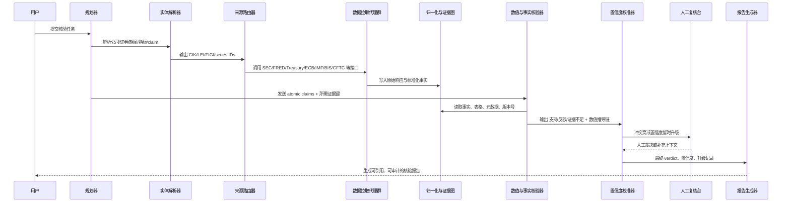
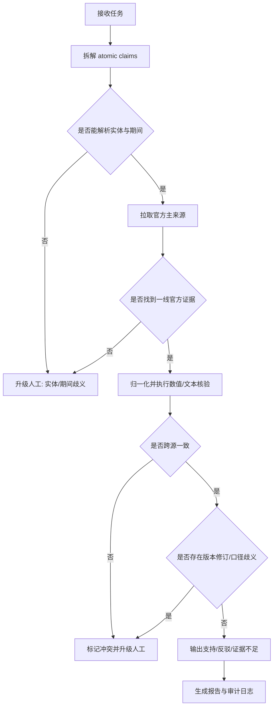

# 面向金融可信核验的 Agentic AI 项目研究报告

## 执行摘要

如果目标是做一个“能核验金融相关任务可信度”的 Agentic AI 项目，最佳路径不是从一个“大而全的聊天代理”开始，而是从一个**以官方原始数据为中心、以结构化证据为核心、以不确定性和人工升级为护栏**的核验系统开始。原因很直接：在金融场景里，最可验证、最可审计、也最适合机器处理的一线证据，主要来自监管申报、XBRL、中央银行和政府统计 API、监管公开报表、实体识别体系与少量官方市场基础设施接口。SEC 的 `data.sec.gov` 已提供无需 API key 的 JSON 化公司申报与提取后的 XBRL 数据，并且在申报分发时实时更新；XBRL US 的公共数据库和 API 又进一步把 SEC/FERC 的 as-filed 报表做成了高颗粒度接口；FRED/ALFRED、美国财政部 Fiscal Data、BEA、BLS、ECB、IMF、BIS、GLEIF、CFTC、OFR、FINRA、World Bank 和 ESMA 则为时间序列、监管与跨市场核验提供了可编程入口。citeturn9view0turn4search4turn9view1turn13search0turn27search1turn9view5turn9view3turn9view6turn30search2turn28view1turn26view3turn26view1turn26view2turn9view13turn9view10

从产品机会看，最值得优先做的不是泛化“投研 Copilot”，而是三类更容易形成差异化与可信壁垒的代理。第一类是**事实核验代理**：验证“媒体/内部 memo/研报/IR 文稿/董事会纪要/业务说明”中的陈述，是否与 10-K、10-Q、8-K、监管披露、宏观发布和官方时间序列一致。第二类是**时间序列异常与一致性核验代理**：自动识别跨来源、跨口径、跨版本（尤其是修订值与 vintage）之间的冲突、跳点、单位错误、基期漂移和实体映射错误。第三类是**面向开发者的核验工作流工具**：把金融问答、解析、引用、数值推导和来源追踪做成可测试、可回归、可设闸的 SDK 与 CI/CD 组件，用隐藏留出集持续评估系统退化。之所以这三类优先级最高，是因为它们同时满足高业务价值、高证据可审计性、以及强数据可得性。FinanceBench、FinQA、TAT-QA、ConvFinQA、TabFact 和 FEVEROUS 等公开数据/基准表明，金融/表格/数值/证据混合核验已经具备清晰的评测对象；而 OpenAI Evals、DeepEval、SWE-bench 与 SWE-agent 则为“开发者工作流中的持续评估”给出了成熟方法论。citeturn22search0turn22search1turn22search14turn22search11turn32search14turn32search13turn21search2turn21search10turn18search2turn21search4

在系统设计上，最稳妥的路线是**多代理编排，但单一证据图与统一审计日志**。建议把系统拆成：任务规划器、实体解析器、来源路由器、数据拉取代理、XBRL/表格归一化器、claim 拆解器、数值程序执行器、证据裁决器、不确定性校准器、报告生成器和人工升级协调器。方法层面，ReAct 适合“推理+行动”的主编排；Toolformer 说明了工具使用本身可以成为模型输出的一部分；Reflexion、Chain-of-Verification、CRITIC、RARR、Self-RAG 和 CRAG 则分别对应“反思记忆”“独立核验问题”“工具交互式批判”“事后检索修订”“检索-生成-批判一体化”和“检索质量自纠偏”等关键能力。对金融可信核验而言，这些论文真正有价值的地方不是“让模型更聪明”，而是**让系统在出错时有可观测的纠偏路径**。citeturn17search0turn17search1turn19search0turn17search2turn34search0turn33search1turn17search3turn20search3

本报告的核心建议是：**先做“官方来源优先、结构化证据优先、数值核验优先、审计可回放优先”的 Verifier，再从 Verifier 外扩到更广义的 Agent。** 在金融场景里，能否给出“证据位置、数值计算链、时间戳、版本号、实体映射和置信度分解”，比生成一段流畅自然语言更重要。SEC 的实时 JSON/XBRL、FRED 的 vintage 体系、GLEIF 的 LEI 主体解析、XBRL US 和 Arelle 的结构化校验能力，本质上都在支持这一点。citeturn9view0turn9view1turn26view0turn9view11turn9view12

## 产品机会与用户需求

### 产品优先级判断

在“影响力、可行性、数据可得性”三个维度上，我建议把产品机会排序为下表中的顺序。这里的优先级不是抽象评分，而是结合了官方数据源成熟度、评测基准成熟度、以及能否形成可审计产品闭环后的综合判断。SEC/EDGAR/XBRL、FRED/ALFRED、Treasury、GLEIF、CFTC、OFR 和 ECB/IMF/BIS 这样的来源，使得“事实核验”和“时间序列核验”远比“直接给投资建议”更适合落地为可信 Agent。citeturn9view0turn9view11turn9view1turn13search0turn26view0turn26view3turn26view1turn9view3turn9view6turn30search2

| 产品方向 | 典型输入 | 影响力 | 可行性 | 数据可得性 | 结论 |
|---|---|---:|---:|---:|---|
| 事实核验代理 | 新闻稿、研报、IR 材料、会议纪要、内部分析文档中的金融陈述 | 5 | 5 | 5 | **最高优先级**；最适合用 SEC/XBRL/官方宏观源构建“逐条 claim + 逐条证据”的核验闭环 |
| 时间序列异常与一致性核验代理 | 宏观、利率、债务、仓位、监管统计、公司历史财务序列 | 5 | 4 | 5 | **高优先级**；FRED/ALFRED、Treasury、ECB、BIS、IMF、CFTC 天然适合做跨源一致性和 vintage 核验 |
| 开发者核验 SDK 与 CI Gate | 金融 QA、财报问答、RAG 引用结果、Agent 输出 | 4 | 5 | 4 | **高优先级**；最容易形成平台效应和内部复用，且可以用公开基准 + 私有留出集持续评估 |
| 实体与口径对齐代理 | ticker、CIK、LEI、FIGI、国家/地区/币种/会计口径映射 | 4 | 4 | 4 | **中高优先级**；是保证上层核验稳定性的基础设施 |
| 监管变化与规则落地核验代理 | 新规摘要、内控说明、产品文档与监管披露的符合性对照 | 4 | 3 | 3 | **中优先级**；价值高，但规则文本、法律解释和 jurisdiction 差异带来更高人工参与需求 |
| 面向终端投资者的“可信投顾式 Agent” | 开放式自然语言提问 | 5 | 2 | 3 | **不建议作为第一阶段主线**；高风险、责任边界复杂、过度泛化会稀释可信核验能力 |

如果只能做一个 MVP，我建议做“**财报与金融陈述事实核验代理**”。它最容易用官方结构化来源得到“支持/反驳/证据不足”的结果，也最适合把数值推导、证据引用和人工复核做深。准确地说，这个产品不是回答“市场会涨吗”，而是回答“这段说法是否与官方材料一致，哪里一致，哪里不一致，证据是什么，置信度为何如此”。FinanceBench、FinQA、TAT-QA、ConvFinQA 与 TabFact 共同说明：金融问答的真正难点往往是**检索到正确证据、正确对齐表格与文本、正确做数值推导、以及正确解释证据边界**，这正是 Verifier 的天然产品边界。citeturn22search0turn22search1turn22search14turn22search11turn32search14

### 目标用户画像

第一类核心用户是**买方/卖方研究员与投研助理**。他们的痛点不是“没有答案”，而是“答案生成得太快、却不知道哪部分是可靠的”。他们需要把 IR 话术、媒体报道、同业比较和财报披露快速对齐到官方证据，并区分“管理层表述”“会计口径事实”“宏观背景变量”和“市场二手解读”这几类不同证据等级。对于这类用户，最重要的功能不是聊天，而是**claim 分解、证据链、引用定位、数值复跑和口径差异提示**。这类需求与 FinanceBench 的 open-book 财务问答、FinQA/TAT-QA/ConvFinQA 的数值推理任务高度一致。citeturn22search0turn22search1turn22search14turn22search11

第二类核心用户是**合规、法务、风险和内审团队**。他们需要验证内部报告、披露草案、对外传播材料或模型输出，是否与监管文件和官方统计一致，尤其关心来源的可追溯性、留痕、版本号、再现性和人工复核入口。对他们而言，“不确定时自动升级人工”比“自动回答一切”更有价值。SEC 的公平访问要求、FRED/BLS/Treasury/BIS/IMF 等接口的使用条款差异，进一步说明这类系统必须把**数据权属、来源条款和限流策略**纳入系统本身，而不能只当成工程细节。citeturn36view2turn36view0turn36view3turn36view4turn36view5turn36view6

第三类核心用户是**金融科技/数据平台/内部 AI 平台团队**。他们更需要“可嵌入的核验中间层”而不是最终应用，也就是：给我统一的接口、证据缓存、可回放 trace、评测脚本和回归闸门，让我把它插到现有问答、检索、投研、监控、Copilot 和生成报告流程中。这就是为什么“开发者核验 SDK + hidden hold-out”是高优先级产品：它最容易在组织内形成基础设施地位，且和 OpenAI Evals、DeepEval、SWE-bench、SWE-agent 这类成熟工具链天然契合。citeturn21search2turn21search10turn18search2turn21search4

第四类用户是**数据新闻、学术研究和公共政策分析人员**。他们更看重跨国比较、时间序列版本控制和来源权威性，因此会更频繁使用 FRED/ALFRED、World Bank、ECB、IMF、BIS、Treasury 与 CFTC/OFR 这样的官方统计源。对这类用户而言，系统必须显式处理“发布日期”“观察期”“是否修订值”“是否 seasonally adjusted”“币种与单位差异”“来源是否官方发布还是衍生聚合”这些元数据。FRED/ALFRED 的 vintage 能力、ECB 的元数据接口、GLEIF 的实体主数据与 World Bank 的明确许可体系，都说明元数据层绝不能被当成附属物。citeturn9view1turn10search15turn9view3turn26view0turn26view7

## Agent 工作流与编排设计

### 核验闭环设计

我建议把系统设计成“**一个总编排器 + 多个窄职责代理 + 一个统一证据图**”。理由是，在金融核验里，错误主要不来自“模型不会写句子”，而来自五类更具体的问题：实体没有对上、来源选错、时间没对齐、数值推导做错、或者 evidence retrieval 看似有结果但其实检索质量不足。ReAct 给出了“边推理边行动”的编排范式；Toolformer 说明工具调用可成为模型能力的一部分；Reflexion、CoVe、CRITIC、RARR、Self-RAG 和 CRAG 又分别对应记忆反思、独立验证问题、工具交互式纠错、检索后修订、自反式检索生成和检索质量纠偏。对你的项目而言，最实用的做法不是照搬某一篇论文，而是把它们拆成系统能力：**先计划，再检索，再校验，再纠偏，再校准不确定性，再决定是否人审**。citeturn17search0turn17search1turn19search0turn17search2turn34search0turn33search1turn17search3turn20search3

建议的代理职责如下。任务规划器负责把用户请求分解成 atomic claims；实体解析器负责把公司、证券、国家、币种、报告期和指标映射到 CIK、LEI、FIGI、官方系列 ID 和 filing accession；来源路由器决定应该去哪类官方源取证；数据拉取代理只做采集与缓存，不做解释；归一化器把 XBRL、JSON、CSV、SDMX、HTML 表格统一成 canonical schema；数值程序执行器把“同比/环比/占比/增量/换算/滚动 12 月”转成可执行程序；证据裁决器负责把每条 claim 标为支持、反驳、部分支持或证据不足；不确定性校准器输出分解后的置信度与升级原因；最终报告器只负责把这些结构化结果转成面向人的说明。这个分层背后的原则是：**把可验证的部分程序化，把主观解释和措辞留到最后**。citeturn9view0turn9view11turn26view0turn9view14turn17search2turn20search1turn34search2

### 不确定性量化与人工升级

对金融核验代理来说，“置信度”不能只是模型自报的 0.87。更合理的做法是把置信度拆成几个可解释分量：**来源权威性**、**跨源一致性**、**时间对齐程度**、**实体解析置信度**、**数值精确度**、**解析链可靠性**。例如，从 SEC Company Facts 与 filings 直接取到的 XBRL fact，通常应高于从 PDF/OCR 或非官方转录文本中抽取的数字；从 FRED 当前值取到的结论，若又经过 ALFRED vintage 核对没有版本冲突，则时间可信度更高；主体名解析若同时能被 CIK、LEI 和 FIGI 约束，则实体映射置信度更高。SEC 的实时 XBRL JSON、FRED/ALFRED 的版本接口、GLEIF 的质量保证 LEI 池和 OpenFIGI 的标识映射，都为这种“分量式置信度”提供了现实基础。citeturn9view0turn9view1turn10search15turn26view0turn9view14

更重要的是，系统应当对“何时必须升级人工”有硬规则，而不是软提示。我建议至少设定以下升级条件：其一，**主张无法找到一线官方来源**；其二，**同一 claim 在两个官方来源之间存在冲突**；其三，**出现 amended filing、restatement 或 vintage 修订**；其四，**单位、币种、基期或口径不明确**；其五，**检索质量评估过低**；其六，**系统只能依赖非官方二手来源**。CRAG、CoVe、CRITIC、RARR、RefChecker、FActScore 和 SelfCheckGPT 的共同启发是：可靠系统不是“永远不给不确定答案”，而是“能识别自己什么时候不该自动下结论”。citeturn20search3turn17search2turn34search0turn33search1turn34search2turn20search1turn20search5

## 官方与开源金融数据平台

### 平台对比与选型建议

严格地说，“全球所有官方/开放金融数据平台”不可能在一份报告里穷举完；更现实的做法，是优先覆盖**最适合做一线可信核验**的官方和开放平台，并把其余平台放入“补充层”。下面这张表按“对金融可信核验的实用价值”而不是按机构名排序。需要特别注意的是，**“官方”不等于“统一开源许可”**：比如 GLEIF 是 CC0，World Bank 默认 CC BY 4.0，ESCB 统计可免费复用但要求署名且不得修改统计，IMF 则是数字访问免费但默认 All Rights Reserved，FRED 还可能受到第三方数据系列权利限制。实际项目应把这些差异编码进数据适配层和结果分发层。citeturn28view0turn26view7turn36view8turn36view6turn36view0

| 平台 | 覆盖内容 | 访问方式 | 准入与许可 | 更新节奏 | 数据质量与系统用途 |
|---|---|---|---|---|---|
| **SEC EDGAR / data.sec.gov** | 公司申报历史、提取后的 XBRL 财务事实、提交记录 | REST/JSON，无需 API key | 公共访问；需遵守 fair access，当前上限 10 req/s，并声明 User-Agent | 申报分发时实时更新 | 一线主来源；最适合做上市公司事实核验、财报数值核验、申报追踪与修订检测。citeturn9view0turn36view2turn12search12 |
| **XBRL US API** | SEC/FERC filed XBRL 的高颗粒度查询 | API + OAuth2；有免费访问与 API key | 可无成本探索；会员通常有更高配额；API 文档开放 | 其公共申报数据库约每 15 分钟从 EDGAR 更新 | 适合作为 SEC 原始 API 的“增强层”，便于做标准化抽取和横向比较。citeturn9view11turn4search4 |
| **Arelle** | XBRL/iXBRL 解析、验证、Python API、Web Service | 开源软件、CLI、Python API | Apache 2.0 | 持续维护 | 适合做本地验证、taxonomy 校验、iXBRL 事实抽取；应成为解析层标准件。citeturn9view12turn23search2 |
| **FRED / ALFRED** | 宏观、利率、就业、价格、银行与政府数据； vintage 历史 | Web API v1/v2，需 API key | 免费 API；受 Terms of Use 约束，且部分系列有第三方权利限制 | 按系列发布频率；v2 支持整批 release 历史与版本 | 宏观核验首选；ALFRED 对修订值和“当时知道什么”非常关键。citeturn9view1turn36view0turn36view1turn10search15 |
| **Federal Reserve Board DDP / Z.1** | 美联储统计发布、金融账户等 | DDP 下载；大量 release 已并入 FRED 生态 | 官方公开获取 | 依统计发布节奏 | 适合补充 FRED，尤其是需要精确对应 Board 发布和 release 级别回放时。citeturn7search2turn7search5turn7search14 |
| **U.S. Treasury Fiscal Data** | 联邦债务、收支、利率、储蓄债券、月度/每日财政数据 | REST/JSON，无需注册 | BFS 开放数据政策；API 受网页条款约束，可限流 | 依数据集而异 | 适合做国债、财政、债务、现金流与利率相关核验。citeturn13search0turn13search1turn36view3 |
| **BEA API** | GDP、NIPA、区域、行业、国际收支等 | HTTPS API，JSON/XML，需免费 API key | 免费 key；官方面向开发者 | 依发布节奏 | 适合做宏观与区域口径核验，尤其是 GDP、行业、地区指标。citeturn27search1turn27search3turn9view4 |
| **BLS Public Data API** | 就业、工资、价格、CPI/PPI 等历史序列 | JSON/Excel；无需注册 | 公开使用；受 ToS 和可能的调用限制约束 | 依调查/发布节奏 | 对通胀、劳动市场和成本核验非常关键。citeturn9view5turn36view4 |
| **CFTC Public Reporting / COT** | COT、Weekly Swaps、FCM 财务、Bank Participation 等 | 网页下载 + API/OData | 官方公开下载和使用 | 周度/月度/报告型 | 适合做衍生品持仓、杠杆与市场结构异常核验。citeturn26view3turn6search17turn6search12 |
| **FINRA Query API** | Equity、Fixed Income、Registration 等 50+ 数据集 | REST Query API；支持同步/异步和变更通知 | 需 FINRA onboarding / 控制台访问 | 依数据集；可轮询通知 | 适合核验券商、债券、注册与市场合规相关任务，但接入门槛高于完全公共源。citeturn26view2turn9view8 |
| **OFR STFM / HFM** | 短期融资市场、对冲基金监测等 | 官方 API | 公共可查询 | 一部分调用可日更，一部分用于定期刷新 | 很适合做系统性风险、融资市场一致性与监测型任务。citeturn26view1turn14search3 |
| **GLEIF API / Global LEI Index** | 法人主体、所有权、映射标识、发行方与代码表 | API + 下载文件 | **CC0**；免费开放；每日 LEI 报送 | 每日数据报送，Golden Copy/Delta | 实体解析的关键底座；非常适合把公司/基金/发行主体统一到 LEI。citeturn28view0turn28view1turn26view0 |
| **OpenFIGI API** | 各类证券标识到 FIGI 的映射 | REST API | 免费公开；匿名流量低限流，API key 可增配额 | 持续服务型 | 适合证券层实体解析，尤其 ticker/ISIN/CUSIP/FIGI 对齐。citeturn9view14 |
| **ECB Data Portal API** | 欧元区及 ECB 官方统计与元数据 | SDMX 2.1 RESTful API | 官方统计可下载；ESCB 统计可免费复用但需署名且不应修改统计 | 依系列与发布节奏 | 做欧元区利率、银行、信贷、支付和宏观核验时非常重要。citeturn9view3turn36view7turn36view8 |
| **BIS Data Portal / API** | 国际银行、证券、流动性、金融稳定相关统计 | SDMX REST API + bulk download | 官方 API；按 permitted use/terms 使用 | 依系列发布节奏 | 全球跨境银行与金融稳定核验的重要来源。citeturn30search2turn36view5turn30search14 |
| **IMF Data API** | WEO、Fiscal Monitor、CPI、BOP、储备等全球宏观金融数据 | SDMX 2.1 / 3.0 API | 数字访问免费，但 IMF 内容默认 All Rights Reserved，须遵守使用条款 | 依数据集；例如 WEO 常见为半年更新 | 适合跨国比较和全球宏观，但许可条款比开放数据平台更保守。citeturn9view6turn30search9turn36view6 |
| **World Bank Indicators API** | 16k+ 时间序列指标，45+ 数据库 | REST/Indicators API | 默认 **CC BY 4.0**，但个别第三方数据例外 | 依数据库/指标而异 | 适合发展、跨国宏观、长期结构性比较。citeturn9view13turn26view7turn26view8 |
| **ESMA Registers / Code Packages** | 欧盟金融市场监管登记与机器到机器服务 | Registers portal + web services + GitHub 代码包 | 官方 EU 监管数据 | 持续发布；2025 起持续增加代码包 | 适合欧盟产品/机构/交易场所/监管登记核验。citeturn9view10turn28view2 |
| **Bank of England Database** | 英国利率、汇率、货币信贷等统计数据库 | 网页导出、CSV/XML、数据库接口样式 URL | 复用需按官网条款核验 | 数据库页面显示最近更新时间 | 适合英国利率/汇率/银行统计核验。citeturn26view4turn8search1 |
| **Nasdaq Data Link / Quandl** | 来自多来源的金融与另类数据平台 | API、SDK、Excel 等 | 平台文档开放，但大量专业数据为 premium；免费数据适合实验与探索 | 数据集依 source 而异 | 应视为**补充层**而非 primary source；适合在官方源不足时做二次补全。citeturn36view9turn36view10turn31search5 |

从工程角度看，最重要的不是“接入尽可能多的数据源”，而是建立**来源分级策略**。建议默认采用三层：第一层是**一线主来源**，只包括 SEC、官方 XBRL、官方宏观/财政/监管 APIs、GLEIF 等；第二层是**官方补充来源**，包括 World Bank、ESMA、Bank of England、XBRL US 这类高价值增强接口；第三层是**平台补充来源**，如 Nasdaq Data Link，只在一线官方源不能直接覆盖任务时触发。这样一来，系统在输出时就能自然地说清楚：这个结论是“官方原始披露支持”，还是“官方统计支持”，还是“平台聚合支持”。citeturn9view0turn9view11turn13search0turn9view1turn28view1turn36view9

此外，强烈建议项目把**数据质量规则**作为一等公民。对美国财报场景，XBRL US Data Quality Committee 提供了公开验证规则，FASB 还把 DQC Rules Taxonomy 纳入 US GAAP taxonomy 生态；这意味着系统完全可以在“模型推理”之前，先做一层“结构化事实是否自相矛盾”的机器规则校验。对金融可信系统而言，这比单纯依赖 LLM 自己“想一想”更可靠。citeturn37search5turn37search4turn37search11

## 研究基础与开源生态

### 关键论文综述

下面这组论文最值得作为你项目的方法论“骨架”。它们并不都来自金融 NLP，但正因为金融可信核验本质上是“工具使用 + 证据检索 + 数值验证 + 自我纠错 + 评测”，这些论文比传统金融情感分类或摘要研究更直接可用。citeturn17search0turn17search1turn17search2turn17search3turn19search0turn20search3turn33search1turn34search0

| 方向 | 论文 | 对项目最重要的启发 |
|---|---|---|
| 规划与工具使用 | **ReAct** | 把“推理轨迹”和“行动调用”交错起来，非常适合做多步取证与核验编排。citeturn17search0 |
| 工具学习 | **Toolformer** | 说明工具调用可以被系统化地融入模型行为；适合定义“何时查 SEC、何时查 FRED、何时算同比”。citeturn17search1 |
| 反思记忆 | **Reflexion** | 出错后把语言反馈写入 episodic memory，对重复性核验任务和开发者回归场景尤其有用。citeturn19search0turn19search2 |
| 独立核验 | **Chain-of-Verification** | 先给初稿，再生成独立核验问题，再独立回答，再修正，是金融事实核验非常自然的流程模板。citeturn17search2turn17search6 |
| 自反式 RAG | **Self-RAG** | 把 retrieval、generation、critique 统一到同一框架；适合做“需不需要继续检索”的自适应策略。citeturn17search3turn17search7 |
| 检索纠偏 | **CRAG** | 给检索结果打分并触发补救动作，对“检索到了东西但不一定对”这一现实问题很关键。citeturn20search3turn20search17 |
| 事后归因修订 | **RARR** | 先生成，再研究来源并修订，使输出可归因；很适合长篇金融说明的核验后编辑。citeturn33search1turn33search2 |
| 工具交互纠错 | **CRITIC** | 用搜索、计算器、代码执行器等工具对输出进行外部反馈式自我修正。citeturn34search0turn34search3 |
| 长文本事实评测 | **FActScore** | 将长答案拆成 atomic facts 逐个做支持度评估，这非常适合金融核验报告的评测。citeturn20search1turn20search7 |
| 黑盒幻觉检测 | **SelfCheckGPT** | 在缺乏外部数据库时，也可以用多次采样一致性做最低限度的自检。citeturn20search5turn20search8 |

若把这些论文映射到你的项目，推荐的策略是：**用 ReAct/LangGraph 实现任务级编排，用 CRAG/Self-RAG 评估检索是否足够，用 CoVe/CRITIC 做 claim 级验证，用 RARR 做最终长文修订，用 FActScore/RefChecker 做输出评测**。这套组合比“只上一个更大的模型”要稳妥得多。citeturn21search3turn21search7turn20search3turn17search3turn17search2turn34search0turn33search1turn20search1turn34search2

### 财经核验相关评测与数据集

你的评测体系最好不要只用通用事实核验集，而要同时覆盖**财务问答、表格事实、数值推理、证据检索、长文引用与开发者回归**。这一点上，公开基准已经足够丰富。FinanceBench 针对基于公开财务文档的 open-book QA；FinQA、TAT-QA 和 ConvFinQA 专注数值推理；TabFact 和 FEVEROUS 更适合 claim-level 表格与混合证据核验；FActScore 适合长报告 factual precision；AgentBench 和 SWE-bench/SWE-agent 则可迁移到“开发者工具链与自动修复/回归”场景。citeturn22search0turn22search1turn22search14turn22search11turn32search14turn32search13turn20search1turn18search9turn18search2turn21search4

| 基准/数据集 | 主要能力 | 为什么适合你的项目 |
|---|---|---|
| **FinanceBench** | 基于公开财务文档的 open-book QA | 最适合作为“财务事实核验代理”的公开外部基准。citeturn22search0turn22search4 |
| **FinQA** | 财务报告数值推理 + 可解释 reasoning programs | 非常适合测试同比、占比、滚动和多步算式核验。citeturn22search1turn22search9 |
| **TAT-QA** | 表格+文本混合证据问答 | 适合财报表格与注释联合核验。citeturn22search14turn22search2 |
| **ConvFinQA** | 对话式财务数值推理 | 适合评估多轮上下文中的数字一致性与引用持续性。citeturn22search11turn22search3 |
| **TabFact** | 基于表格的事实核验 | 对“这句话是否被表格支持”很有参考价值。citeturn32search14turn32search0 |
| **FEVEROUS** | 文本+表格混合证据核验 | 非常接近金融核验里的“表格+注释+正文”混合场景。citeturn32search13turn32search5 |
| **FActScore** | 长文 atomic fact 支持度 | 适合评估系统最终生成的长篇核验报告。citeturn20search1turn20search4 |
| **SWE-bench / SWE-agent** | 真实开发任务与自动修复 | 适合做“核验 SDK/工具链”的工程级回归评测方法借鉴。citeturn18search2turn21search4turn21search8 |

真正落地时，我建议采用“**公开基准 + 私有隐藏留出集**”双轨制。公开基准负责与外部成果对齐；私有隐藏留出集则负责防止系统对公开 benchmark 过拟合。隐藏留出集最好按**发行人、申报期、表单类型、会计主题、宏观主题、地区**分层抽样，且强制把“修订值/改报/多口径/单位转换/跨源冲突”纳入。这样才能真正评估核验系统在真实金融工作流中的可靠性。这个建议虽是工程判断，但其方向与 Evals、DeepEval、FinanceBench、FActScore 和 SWE-bench 的思想是一致的。citeturn21search2turn21search10turn22search0turn20search1turn18search2

### 权威开源仓库与组件

在开源实现层，建议尽量选择“**官方或事实标准仓库**”，避免生态里大量短命 demo。下面这些仓库最值得优先纳入。citeturn21search3turn9view12turn23search1turn24search0turn24search2turn24search13turn24search9turn21search2turn21search10

| 组件 | 推荐仓库 | 价值 |
|---|---|---|
| Agent 编排 | **LangGraph** | 低层、可控、状态化、支持 human-in-the-loop 和 durable execution，适合作为生产级编排器。citeturn21search3turn21search7 |
| XBRL 解析与验证 | **Arelle** | XBRL/iXBRL 标准工具，支持桌面、CLI、Web Service、Python API。citeturn9view12 |
| iXBRL 浏览 | **Arelle iXBRL Viewer** | 方便人工复核、解释与 table extraction 调试。citeturn23search2 |
| SEC Python 接入 | **EdgarTools** | 非官方但实用，提供结构化访问 SEC filings 的一致 API。citeturn23search1 |
| XBRL US 文档与接口 | **xbrlus/xbrl-api** | 对接 XBRL US 公共数据库的开放文档仓库。citeturn4search4turn4search4 |
| 数据聚合底座 | **OpenBB ODP** | 作为 open-source 数据接入层有价值，但必须保留原始来源 provenance。citeturn23search4 |
| 推理服务 | **vLLM** | 高吞吐、内存高效，适合服务化部署较大开源模型。citeturn24search0turn24search10 |
| 本地推理 | **llama.cpp** | 适合边缘部署和本地验证任务。citeturn24search1 |
| 向量检索 | **Qdrant** | 生产化向量库，支持 payload 过滤，适合与元数据约束结合。citeturn24search2turn24search12 |
| 分析引擎 | **DuckDB + Polars** | DuckDB 适合本地 OLAP 与 Parquet/JSON 查询，Polars 适合高性能 DataFrame 处理。citeturn24search13turn24search18turn24search4turn24search9 |
| 评测框架 | **openai/evals、DeepEval、RefChecker、FActScore** | 适合做回归测试、事实核验、长文事实评分与引用检查。citeturn21search2turn21search10turn34search2turn20search4 |
| 方法复现 | **SELF-RAG、CRAG、RARR、Reflexion、SWE-agent** | 适合作为方法原型和 ablation 对照。citeturn17search11turn20search0turn33search0turn19search1turn21search8 |

## 实施方案与路线图

### 技术栈与模块划分

在“无明确预算、算力、延迟约束”的前提下，我建议采用**重证据、重缓存、重评测**的栈，而不是极度追求单次响应速度。最稳妥的组合是：编排层用 LangGraph；在线推理层用 vLLM，离线/本地辅助推理可用 llama.cpp；数据层用对象存储 + Parquet + DuckDB + Polars；全文与元数据检索采用“BM25/关键词 + 向量 + 结构化过滤”的混合检索；XBRL 与 iXBRL 解析层采用 Arelle；评测层用 OpenAI Evals/DeepEval/FActScore/RefChecker；来源适配层则分别对 SEC、FRED/ALFRED、Treasury、BEA、BLS、GLEIF、CFTC、ECB、BIS、IMF、World Bank 等构建 typed client。citeturn21search3turn24search0turn24search1turn24search13turn24search9turn24search2turn9view12turn21search2turn21search10turn20search4turn34search2

模型方面，如果希望尽量开源化，我会把模型职责分成三层。**主推理/主编排模型**建议优先测试 Qwen3.6 或同级别具备 tool use 与长上下文能力的模型；**代码与 developer workflow 子代理**可优先测试 Devstral / Mistral Small 家族；**低成本辅助模型**可用较小的 Qwen 或 Mistral 变体处理 schema 发现、规则检查、格式化和 rerank。Qwen3.6 的官方模型卡已经明确给出 tool use 和 vLLM/SGLang 部署方式；Mistral 的官方模型页则把 Devstral、Mistral Small、Magistral 等开放权重模型定位为 coding、reasoning 与通用用途。citeturn25search11turn25search3turn25search8turn25search20

一个非常重要的架构判断是：**不要让 LLM 直接“看原始网页然后回答”，而要让它“消费经过标准化的证据对象”**。证据对象至少应包含：`source_type`、`authority_tier`、`entity_id`、`report_period`、`filing_date`、`observation_date`、`vintage_date`、`unit`、`currency`、`fact_name`、`value`、`provenance_locator`、`parser_confidence` 和 `license_tag`。这会显著提高可测试性和可解释性，也能让人审界面直接回放 evidence。SEC、FRED/ALFRED、GLEIF 和 ECB/SDMX 等数据源天然具有这类元数据，最适合做 canonical schema。citeturn9view0turn9view1turn26view0turn9view3

```mermaid
flowchart LR
    subgraph Sources[官方与开放数据源]
        SEC[SEC EDGAR / XBRL]
        XU[XBRL US]
        FRED[FRED / ALFRED]
        UST[U.S. Treasury]
        BEA[BEA]
        BLS[BLS]
        GLEIF[GLEIF / OpenFIGI]
        CFTC[CFTC]
        ECB[ECB]
        BIS[BIS]
        IMF[IMF]
        WB[World Bank]
    end

    subgraph Ingestion[接入与标准化]
        ADP[Typed API Adapters]
        PARSE[XBRL / SDMX / JSON Parsers]
        CANON[Canonical Facts Schema]
        LAKE[Parquet + Object Store]
        IDX[BM25 + Vector + Metadata Index]
    end

    subgraph Runtime[Agent Runtime]
        PLAN[Planner]
        RESOLVE[Entity Resolver]
        RETRIEVE[Retriever]
        VERIFY[Claim & Numeric Verifier]
        CAL[Uncertainty Calibrator]
        REPORT[Report Composer]
    end

    subgraph Governance[评测与治理]
        EVAL[Golden Sets + Hidden Holdout]
        TRACE[Audit Logs + Replay]
        HITL[Human Review Queue]
        CI[CI/CD Gates]
    end

    Sources --> ADP --> PARSE --> CANON
    CANON --> LAKE
    CANON --> IDX

    PLAN --> RESOLVE --> RETRIEVE
    RETRIEVE --> IDX
    RETRIEVE --> LAKE
    RETRIEVE --> VERIFY --> CAL --> REPORT

    VERIFY --> TRACE
    CAL --> HITL
    REPORT --> TRACE
    EVAL --> CI
    TRACE --> EVAL
```

### 测试策略与评测指标

一个金融核验代理的测试策略，必须比普通问答系统更接近“数据工程 + 风险系统 + 生成系统”的混合体。我建议至少分成五层。第一层是**适配器契约测试**：检查每个官方 API 的 schema、字段语义、限流、重试与分区拉取是否稳定。第二层是**解析正确性测试**：尤其针对 XBRL、iXBRL、表格、货币单位、比例/百分比、negative sign、scale 和 periods。第三层是**claim 级裁决测试**：给定证据对象，支持/反驳/不足的标签是否正确。第四层是**端到端任务回归**：在 golden tasks 与 hidden hold-out 上跑全链路。第五层是**对抗与安全测试**：包括 prompt injection、网页脏数据、错误 ticker 映射、冲突修订值、重复表、单位漂移、以及“只改措辞不改事实”的误导性输入。OWASP 的 LLM 风险项目和 NIST AI RMF/GenAI Profile 对 prompt injection、数据投毒、过度代理、信息完整性与人机配置风险都给出了明确提醒。citeturn35search0turn35search11turn35search1turn35search2

评测指标方面，至少应包括以下七类。其一，**Fact Verdict F1**，衡量 support/refute/insufficient 的正确率。其二，**Evidence Sufficiency**，衡量系统给出的证据是否真的足以支持结论。其三，**Numeric Exactness**，对 exact match、相对误差、容差带单独计分。其四，**Attribution Coverage**，衡量最终报告中有多少 atomic facts 带有可回溯证据。其五，**Calibration**，衡量高置信输出是否真的更准，可用 Brier Score / ECE。其六，**Escalation Precision**，衡量系统把真正困难/冲突案例升级给人工的能力。其七，**Replayability**，即是否能仅凭 trace 重放核验结果。FActScore、RefChecker、FEVEROUS、TabFact、FinanceBench 和 FinQA/TAT-QA 为这些指标提供了很好的参考坐标。citeturn20search1turn34search2turn32search13turn32search14turn22search0turn22search1turn22search14

### 端到端演示场景

下面给出一个适合作为 demo day 或内部试点的端到端场景。这个场景故意选择“**核验内部分析文档中的多条财务陈述**”而不是泛泛聊天，因为它最能体现系统价值。

假设用户提交如下任务：  
“请核验这段内部分析摘要：`公司 X 最近季度营收同比增长；经营现金流改善主要来自营运资本释放；回购额高于去年同期；净杠杆下降。请只使用官方来源，并给出证据位置和置信度。`”

系统的理想执行链路如下。首先，规划器把请求拆成四条 atomic claims，并识别出这是一家上市公司季度核验任务，因此默认优先拉取 SEC 10-Q、8-K earnings release exhibit、companyfacts，以及上年同期可比期间；若主体映射不唯一，则用 CIK + LEI + FIGI 约束。其次，检索层通过 SEC 的 submissions/companyfacts 和必要的 filing 文档，抽取营收、经营现金流、回购与债务/杠杆相关字段；若某些字段无法在 companyfacts 中直接获取，再退回 XBRL US / Arelle 解析 filed facts。第三，数值核验器对“同比增长”“高于去年同期”“净杠杆下降”转成程序化判断，并输出公式与中间值。第四，文本核验器针对“主要来自营运资本释放”这类较难完全结构化的陈述，优先查 MD&A、management discussion 和 8-K 附件正文中的相关表述，并把结果标成“支持”“部分支持”或“证据不足”。第五，不确定性校准器根据来源权威性、跨源一致性、数值精确度和文本支持强度给出 score；若“主要来自”缺乏明示官方表述，则强制降级置信度或升级人工。最后，报告生成器输出结构化 verdict。这个思路直接继承了 SEC/XBRL 的结构化优势，以及 CoVe/CRAG/FActScore 式的 claim-first 核验逻辑。citeturn9view0turn9view11turn9view12turn17search2turn20search3turn20search1

预期输出应长这样，而不是一段不可审计的自然语言：

| Claim | Verdict | 证据 | 计算链 | 置信度 | 备注 |
|---|---|---|---|---:|---|
| 最近季度营收同比增长 | 支持 | 10-Q / Company Facts 中本季与上年同期 Revenue 字段 | `(本季-上年同期)/上年同期` | 0.96 | 结构化、可复算 |
| 经营现金流改善主要来自营运资本释放 | 部分支持/证据不足 | MD&A 中现金流解释段落 + 现金流量表相关项目 | 文本型解释，无单一结构化字段 | 0.58 | 建议人工复核措辞“主要来自” |
| 回购额高于去年同期 | 支持 | 10-Q 股票回购表 / 8-K 附件 | 同期直接比较 | 0.93 | 引用表格位置 |
| 净杠杆下降 | 支持或证据不足 | 债务项目、现金及等价物、管理层定义的 leverage 指标 | 若管理层自定义净杠杆，需口径映射 | 0.71 | 若公司自定义口径则提示 |

这类 demo 的关键，不在于“回答得像分析师”，而在于它能否把**事实、证据、计算、口径和不确定性全部并排呈现**。这才是金融可信核验代理最能打动内部用户的地方。citeturn20search1turn34search2

### 路线图建议

在 6–12 周周期里，我建议把目标设定为“先形成一条可工作的核验主链，再扩源，再做评测平台化”。

| 时间段 | 里程碑 | 交付物 |
|---|---|---|
| 第一个阶段 | 打通主来源与 canonical schema | SEC、FRED/ALFRED、Treasury、GLEIF、BEA/BLS 适配器；统一事实对象；审计日志最小实现 |
| 第二个阶段 | 完成 claim 分解与数值核验最小闭环 | atomic claim 分解器、数值程序执行器、SEC/XBRL 财报核验 demo |
| 第三个阶段 | 上线不确定性与 HITL | 置信度分解、升级规则、人工复核工作台 |
| 第四个阶段 | 建立评测与回归体系 | FinanceBench/FinQA/TAT-QA/TabFact 数据接入；私有留出集；CI 闸门 |
| 第五个阶段 | 扩展跨国与监管数据 | ECB、BIS、IMF、World Bank、CFTC、OFR、ESMA 数据接入 |
| 第六个阶段 | 工程与安全收口 | 限流、缓存、重试、红队测试、条款治理、beta 发布 |

如果资源允许到 12 周，我会把“开发者核验 SDK + hidden hold-out 评测台”作为第二主线同步推进。原因是：越早把评测和回归放进去，后续扩展来源和模型时越不容易“看起来变强、其实更不可信”。这与 Evals、DeepEval 和 SWE-bench/SWE-agent 背后的工程经验高度一致。citeturn21search2turn21search10turn18search2turn21search4

## 安全合规伦理与主要风险

金融核验代理最容易被忽视的，不是模型精度，而是**来源治理、法律边界和系统性过度自信**。首先，必须承认官方数据的许可并不统一：GLEIF 是 CC0，World Bank 默认 CC BY 4.0，ESCB 统计可免费复用但要求注明来源且不要修改统计，FRED 可能受底层第三方系列版权限制，IMF 则是免费数字访问但默认 All Rights Reserved，Nasdaq Data Link 又大量依赖 premium 数据。换言之，你的系统既需要“来源权威性分层”，也需要“许可标签分层”，并在对外分发、缓存、导出、再训练和二次分发时执行不同策略。citeturn28view0turn26view7turn36view8turn36view0turn36view6turn36view10

其次，系统应明确遵守各平台的公平访问与使用限制。SEC 明确要求 fair access 且当前最大请求率为 10 req/s；Treasury、BLS、BIS、FRED 都保留对过度或违规使用进行限制甚至封禁的权利。对生产系统而言，这意味着：必须做客户端侧限流、缓存、批处理、幂等重试、指数退避和请求 provenance；更重要的是，应避免在每次用户提问时重新全量抓取公开站点。官方机器接口优先、增量同步优先、本地标准化缓存优先，这是合规与稳定性同时要求出来的架构结论。citeturn36view2turn36view3turn36view4turn36view5turn36view0

再次，要把 GenAI 原生风险纳入系统设计。OWASP LLM Top 10 和 NIST GenAI Profile 都明确把 prompt injection、数据投毒、过度代理、敏感信息泄露、信息完整性与人机配置失衡当成关键风险。对你的项目，最现实的三个威胁是：其一，**工具输出注入**，例如解析到的网页/文档中包含诱导模型忽略系统规则的文本；其二，**数据污染与伪官方源混入**，例如把二手转录件当成官方证据；其三，**过度自动化**，在没有足够证据时仍给出高置信结论。因此，系统应强制主来源白名单、禁用不受控网页自动扩展、对工具输出做隔离和规范化、并把低置信/冲突场景自动升级人工。citeturn35search0turn35search11turn35search1turn35search2

最后，伦理层面最需要防止的是**把“核验系统”误卖成“投资判断系统”**。一个好的核验代理应说“这条说法与官方材料一致/不一致，证据在这里”，而不是说“所以你应该买/卖”。在金融领域，可信系统的职责边界越清晰，越容易建立组织信任。SEC/XBRL、FRED/ALFRED、GLEIF 和官方统计源的价值就在于它们能帮助系统把结论锚定到事实，而不是把模型伪装成权威。citeturn9view0turn9view1turn26view0

### 优先下一步

如果今天就要决定启动顺序，我建议按下面的优先级推进：

| 优先级 | 下一步 | 原因 |
|---|---|---|
| 最高 | 只接入一线官方主来源并定义 canonical schema | 没有统一事实对象，后面所有 agent 能力都会变成脆弱的 prompt engineering |
| 很高 | 实现 claim 分解 + 数值程序执行 + 证据裁决 | 这是把“会说”变成“会核验”的核心拐点 |
| 很高 | 建立隐藏留出集和回归闸门 | 不先建立评测，后续接入更多模型/数据会快速失控 |
| 高 | 上线置信度分解与人工复核台 | 可信系统必须把“我不确定”做成产品能力 |
| 高 | 扩展跨国和监管数据 | 能把美国单一市场核验扩到全球宏观和欧盟监管，项目壁垒会明显提升 |
| 中高 | 做开发者 SDK / API 产品化 | 最容易在组织内部沉淀为共享基础设施 |

### 开放问题与限制

本报告有三个需要明确的限制。第一，“全球所有官方/开放金融数据平台”无法完全穷举，本文优先覆盖了对可信核验最有实战价值的一线官方源和重要补充源。第二，**官方实时交易所级市场数据**通常不像监管披露和宏观统计那样开放，很多高质量市场数据仍需商业订阅，因此第一阶段产品应尽量避免把 tick 级实时行情作为核心依赖。第三，像 earnings call transcript、卖方估计、新闻摘要这类常见金融文本，很多并非官方开放源，若要纳入系统，必须始终把它们标成低于监管披露的证据等级。citeturn36view10turn31search5turn9view0

综合来看，最值得建设的不是一个“会聊金融”的 Agent，而是一个**以官方证据为中心、能做结构化核验、能输出置信度并知道何时升级人工的金融可信验证引擎**。只要你把这条主线打穿，后面的问答、Copilot、监控、研究助手和开发者工具，都会变成自然外延，而不是高风险的空中楼阁。